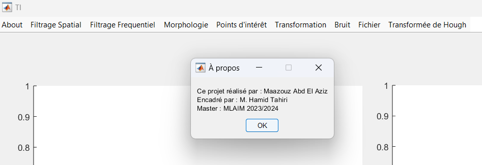

# Image Processing Project


## Overview
This project focuses on various image processing techniques implemented in MATLAB. It includes operations such as morphological contour detection, Hough transform for detecting lines and circles, image brightness adjustment, spatial and frequency filtering, and histogram operations.

## Features
- **Morphological Contour Detection**: Detects contours in images using morphological operations like dilation and erosion.
- 
- **Hough Transform for Line Detection**: Identifies straight lines in images using the Hough transform.
- **Hough Transform for Circle Detection**: Detects circles in images using the Hough transform.
- **Image Brightness Adjustment**: Adjusts the brightness of an image by adding a constant value to pixel intensities.
- **Spatial Filtering**: Applies spatial filters to images for operations such as smoothing and sharpening.
- **Frequency Filtering**: Applies frequency domain filters to images for operations such as noise reduction and feature enhancement.
- **Histogram Operations**: Performs operations on the histogram of an image for contrast enhancement and equalization.

## Installation
To run this project, you need to have MATLAB installed on your system. Follow these steps to set up the project:
1. Clone this repository:
    ```bash
    git clone https://github.com/yourusername/your-repo-name.git
    ```
2. Navigate to the project directory:
    ```bash
    cd your-repo-name
    ```

## Menu
The project includes a menu-driven interface in MATLAB for easy access to the various functionalities. You can load the project file (`TI.m`) in MATLAB and use the following options from the menu:

- **Contour Morphologique**: Detect morphological contours in the image.
- **Hough Droites**: Detect straight lines using the Hough transform.
- **Hough Cercles**: Detect circles using the Hough transform.
- **Augmenter la Luminosité**: Increase the brightness of the image.
- **Filtrage Spatial**: Apply spatial filtering to the image.
- **Filtrage Fréquentiel**: Apply frequency filtering to the image.
- **Histogramme**: Perform histogram operations on the image.

## Dependencies
- MATLAB
- Image Processing Toolbox

## Contributing
If you would like to contribute to this project, please fork the repository and submit a pull request. For major changes, please open an issue first to discuss what you would like to change.

## License
This project is licensed under the MIT License - see the [LICENSE](LICENSE) file for details.

## Contact
If you have any questions or feedback, feel free to contact me at [your-email@example.com].

---

Feel free to customize this template according to your specific needs and preferences. If you need further assistance or modifications, let me know!
