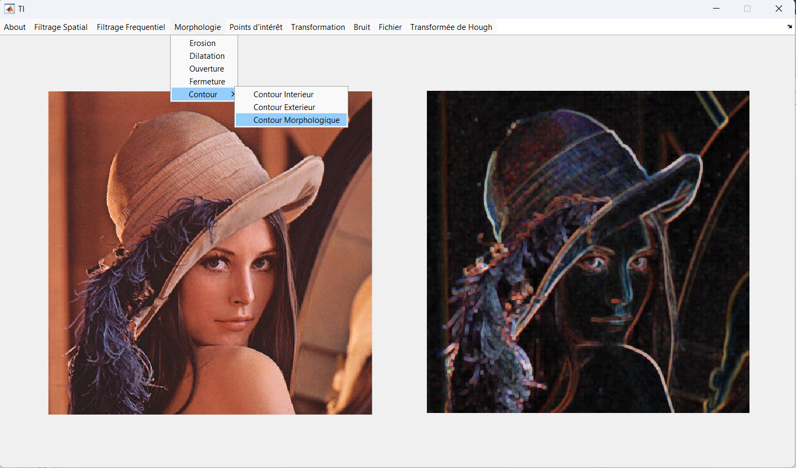
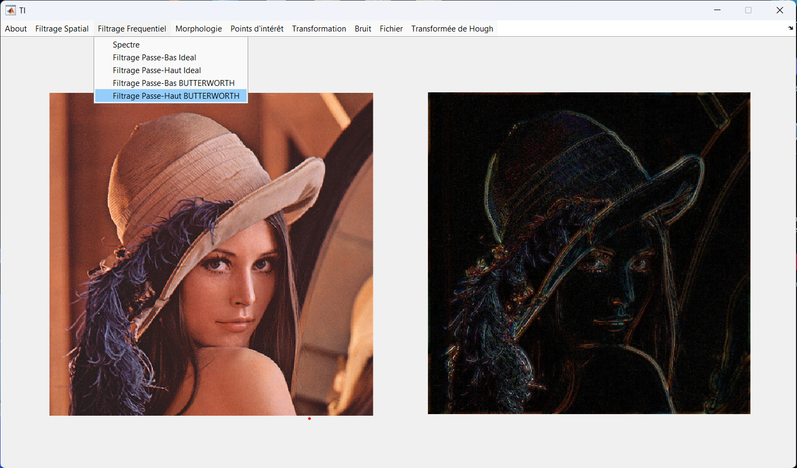

# Image Processing Project

## Overview
This project focuses on various image processing techniques implemented in MATLAB. It includes operations such as morphological contour detection, Hough transform for detecting lines and circles, image brightness adjustment, spatial and frequency filtering, and histogram operations.

## Features
- **Morphological Contour Detection**: Detects contours in images using morphological operations like dilation and erosion.
  
  
  
- **Hough Transform for Line Detection**: Identifies straight lines in images using the Hough transform.
  
  
  
- **Hough Transform for Circle Detection**: Detects circles in images using the Hough transform.
  
  
  
- **Image Brightness Adjustment**: Adjusts the brightness of an image by adding a constant value to pixel intensities.
  
  
  
- **Spatial Filtering**: Applies spatial filters to images for operations such as smoothing and sharpening.
  
  
  
- **Frequency Filtering**: Applies frequency domain filters to images for operations such as noise reduction and feature enhancement.
  
  
  
- **Histogram Operations**: Performs operations on the histogram of an image for contrast enhancement and equalization.
  
  

- **For more features try [EXEC file](IPP-EXE-FILE)**

  
## Dependencies
- MATLAB
- Image Processing Toolbox

## Contact
If you have any questions or feedback, feel free to contact me at [Maazouz AbdelAziz](https://www.linkedin.com/in/abdelaziz-maazouz/) .

